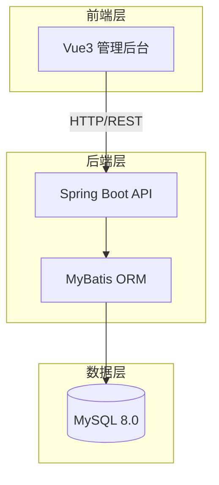
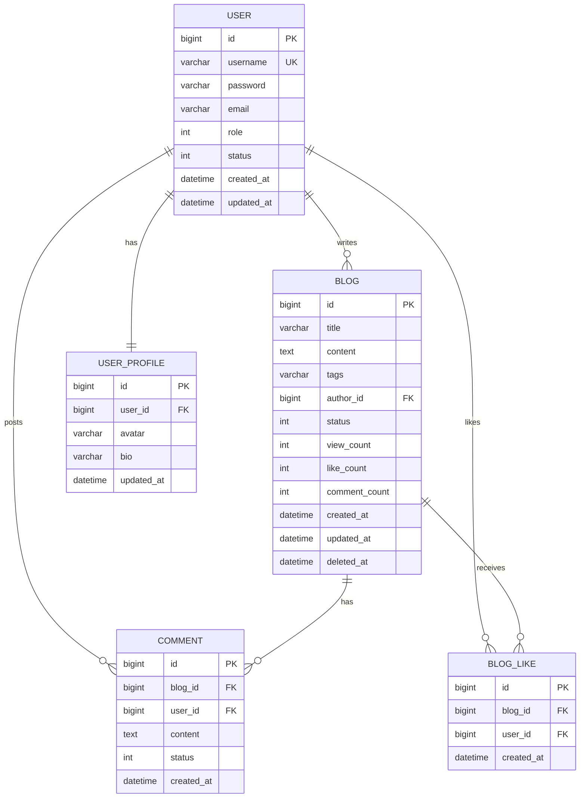

# 个人博客系统 - 项目设计文档

## 1. 系统架构



## 2. ER 图



## 3. 接口清单

### 3.1 认证模块 (AuthController)
| 方法 | 路径 | 描述 |
|------|------|------|
| POST | /api/auth/register | 用户注册 |
| POST | /api/auth/login | 用户登录 |
| POST | /api/auth/logout | 用户登出 |
| GET | /api/auth/info | 获取当前用户信息 |

### 3.2 博客模块 (BlogController)
| 方法 | 路径 | 描述 |
|------|------|------|
| GET | /api/blogs | 获取博客列表（分页） |
| GET | /api/blogs/{id} | 获取博客详情 |
| POST | /api/blogs | 发布博客 |
| PUT | /api/blogs/{id} | 更新博客 |
| DELETE | /api/blogs/{id} | 删除博客（软删除） |
| GET | /api/blogs/user/{userId} | 获取用户博客列表 |
| GET | /api/blogs/my | 获取我的博客列表 |

### 3.3 评论模块 (CommentController)
| 方法 | 路径 | 描述 |
|------|------|------|
| GET | /api/comments/blog/{blogId} | 获取博客评论列表 |
| POST | /api/comments | 发表评论 |
| DELETE | /api/comments/{id} | 删除评论 |

### 3.4 点赞模块 (LikeController)
| 方法 | 路径 | 描述 |
|------|------|------|
| POST | /api/likes/blog/{blogId} | 点赞/取消点赞 |
| GET | /api/likes/blog/{blogId}/status | 获取点赞状态 |

### 3.5 用户模块 (UserController)
| 方法 | 路径 | 描述 |
|------|------|------|
| GET | /api/users/{id} | 获取用户信息 |
| PUT | /api/users/profile | 更新个人资料 |
| GET | /api/users/{id}/stats | 获取用户统计数据 |

### 3.6 管理模块 (AdminController)
| 方法 | 路径 | 描述 |
|------|------|------|
| GET | /api/admin/users | 获取用户列表 |
| PUT | /api/admin/users/{id}/status | 更新用户状态 |
| GET | /api/admin/blogs | 获取全站博客列表 |
| PUT | /api/admin/blogs/{id}/status | 更新博客状态 |
| GET | /api/admin/comments | 获取全站评论列表 |
| DELETE | /api/admin/comments/{id} | 删除评论 |

## 4. UI/UX 规范

### 4.1 色彩系统
- 主色调: #409EFF (Element Plus 蓝)
- 成功色: #67C23A
- 警告色: #E6A23C
- 危险色: #F56C6C
- 信息色: #909399
- 背景色: #F5F7FA
- 文字主色: #303133
- 文字次色: #606266

### 4.2 字体规范
- 主字体: -apple-system, BlinkMacSystemFont, 'Segoe UI', Roboto, 'Helvetica Neue', Arial, sans-serif
- 标题字号: 20px / 18px / 16px
- 正文字号: 14px
- 辅助字号: 12px

### 4.3 间距规范
- 页面边距: 24px
- 卡片间距: 16px
- 元素间距: 8px / 12px / 16px

### 4.4 圆角规范
- 卡片圆角: 8px
- 按钮圆角: 4px
- 输入框圆角: 4px

## 5. 安全设计

### 5.1 密码安全
- 使用 BCrypt 加密存储
- 密码复杂度: 至少8位，包含字母和数字

### 5.2 会话管理
- 基于 Token 的认证机制
- Token 有效期: 24小时
- 支持主动登出

### 5.3 权限控制
- 角色: 普通用户(0)、管理员(1)
- 接口级别权限验证
- 资源所有权验证

## 6. 日志设计

### 6.1 操作日志
- 用户登录/登出
- 博客增删改
- 评论增删
- 管理员操作

### 6.2 日志格式
```
[时间] [级别] [用户ID] [操作类型] [操作详情] [IP地址]
```
